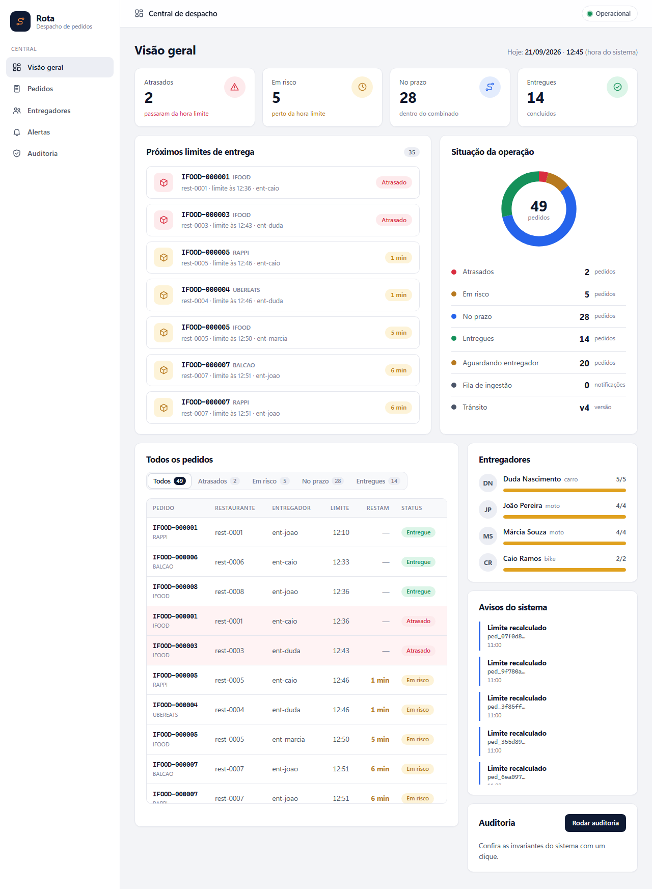
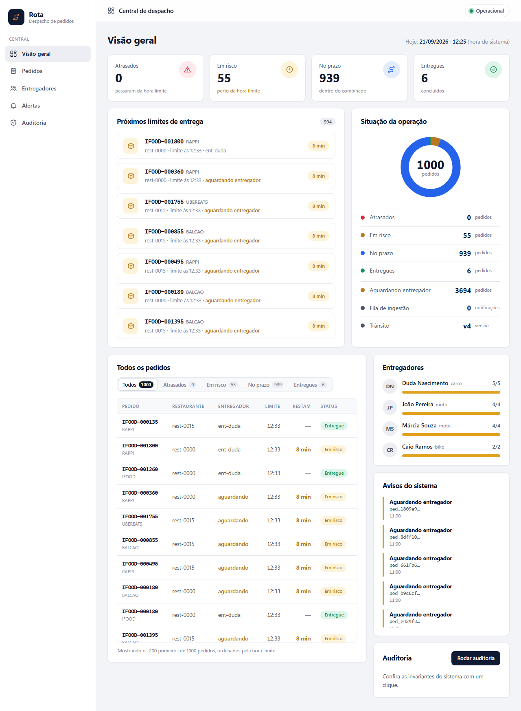
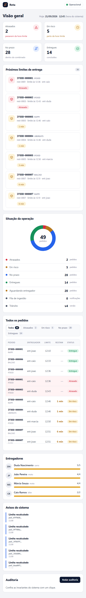

# rota — Núcleo de Despacho de Pedidos (Entrega 1)

[](https://github.com/gabrielfranca10/rota-fccpd/actions/workflows/ci.yml)

**Disciplina:** CCA — Fundamentos de Computação Concorrente, Paralela e Distribuída — CESAR School, 2026.2
**Professor:** Jorge Soares de Farias Júnior
**Equipe:** Gabriel França · Caio Leimig · Fernando Soares · Ramsés Cordeiro

O **rota** é o núcleo de despacho de pedidos de uma central de delivery multi-plataforma. Esta
entrega traz a **arquitetura completa** e um **protótipo single-node com concorrência local**:
receber notificações de pedido em rajada, deduplicá-las, calcular a **hora limite de entrega**
(preparo, distância, pico de trânsito, bloqueio de via, entrega expressa), despachar automaticamente
para o entregador disponível de menor carga sem nunca estourar sua capacidade, manter uma fila de
espera para quando a frota está cheia, monitorar pedidos em risco e recalcular tudo quando o
trânsito muda — sem nunca duplicar, perder ou calcular errado um pedido, mesmo com dezenas de
threads ao mesmo tempo.

## Rodando em 1 minuto

Requisito: **Python 3.10+**. Não há dependências externas. (No Windows use `python` no lugar de `python3`.)

```bash
python3 -m unittest discover -s tests -t .              # 42 testes
python3 -m rota --relogio-simulado 2026-09-21T11:00      # servidor em http://127.0.0.1:8080
python3 scripts/carga.py                                 # em outro terminal: carga + auditoria
```

Abra `http://127.0.0.1:8080` no navegador para ver o dashboard ao vivo. Consulta rápida via API:
`curl http://127.0.0.1:8080/api/v1/pedidos?status=EM_RISCO`

A cada push o [CI](.github/workflows/ci.yml) roda os 42 testes (Python 3.10 e 3.13), as duas demos de
concorrência e uma carga reduzida que só passa se a auditoria das invariantes voltar `ok`.

## O dashboard

Painel somente leitura sobre a API, atualizado a cada 4 s: pedidos por situação, os próximos limites de
entrega, ocupação de cada entregador, avisos do sistema e a auditoria das invariantes sob demanda.



Durante a rajada de 5 000 notificações do `scripts/carga.py` (4 entregadores, capacidade total 15), quase
todos os pedidos ficam aguardando entregador e os entregadores aparecem no limite. É o comportamento
esperado sob escassez de frota, não uma falha (ver doc 04).



Em tela estreita o menu lateral some e as colunas se reorganizam:



## Documentação (mapeada à rubrica)

| Documento | Critério da rubrica |
|---|---|
| [01 — Escopo e arquitetura](docs/01-escopo-e-arquitetura.md) | Project Scope and Architecture Design |
| [02 — Concorrência e sincronização](docs/02-concorrencia-e-sincronizacao.md) | Identification of Concurrency Risks and Synchronization |
| [03 — Protocolos e dados](docs/03-protocolos-e-dados.md) | Communication Protocols and Data Handling |
| [04 — Protótipo e resultados](docs/04-prototipo-e-resultados.md) | Single-Node Prototype Execution |
| [05 — Registro de uso de IA](docs/05-registro-uso-ia.md) | Artificial Intelligence Usage and Documentation |
| [06 — Apresentação e perguntas](docs/06-apresentacao.md) | Oral Presentation and Team Collaboration |

## Estrutura

```
rota/
  __main__.py     linha de comando e desligamento gracioso
  nucleo.py       núcleo concorrente: ingestão, pedidos, despacho, trânsito, monitor, auditoria
  transito.py     estado de trânsito imutável + cálculo da hora limite de entrega (função pura)
  rwlock.py       lock de leitores/escritor com preferência para o escritor
  http_api.py     servidor HTTP com pool limitado de threads + rotas REST/JSON + dashboard estático
  dominio.py      entidades, erros e validação de identificadores
  relogio.py      relógio real (horário de Brasília) e simulado
  seed.py         entregadores e restaurantes fictícios
  static/         dashboard.html/css/js (painel visual somente leitura sobre a API)
scripts/          demo.py, demo_corrida.py, demo_deadlock.py, carga.py
tests/            test_transito, test_nucleo, test_concorrencia, test_http
docs/             documentos 01 a 06
```

## Antes de entregar (checklist da equipe)

- [ ] Rodar testes e `scripts/carga.py` na máquina de vocês e atualizar os números do doc 04.
- [ ] Preencher o doc 05 (prompts literais e decisões aceitas/rejeitadas **com as palavras de vocês**).
- [ ] Cada membro conseguir responder, sem olhar, as perguntas do doc 06.
- [ ] Ensaiar a apresentação cronometrada (10 min) com a demo ao vivo (dashboard aberto no navegador).

> Aviso: o cálculo de trânsito do protótipo é uma simplificação didática (velocidade constante +
> fator de pico/bloqueio). Não substitui um serviço de mapas/roteirização real.
